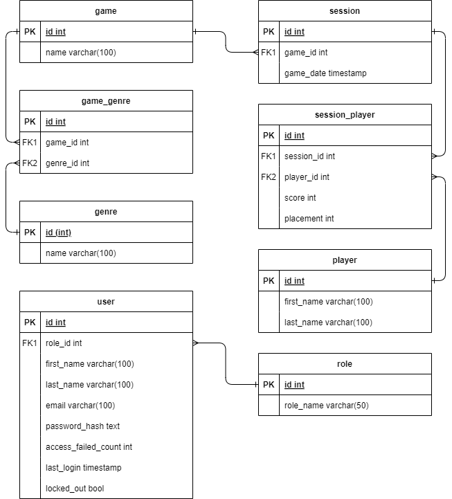

# Gaming Leaderboards

Gaming Leaderboards is a web application designed to manage and display leaderboards for various games. It allows users to create, view, and manage leaderboards, including adding players and their scores. The application is built with a modern tech stack, including React for the frontend, Node.js and Express for the backend, and PostgreSQL for the database. It also leverages Docker for containerization and Prisma as the ORM for database interactions.

## Table of Contents

- [User Roles and Privileges](#user-roles-and-privileges)
- [Root User Login Credentials](#root-user-login-credentials)
- [Demo](#demo)
- [Database Schema](#database-schema)
- [Local Development Setup](#local-development-setup)
- [Registering the Server in pgAdmin](#registering-the-server-in-pgadmin)
- [Responsiveness Guide](#responsiveness-guide)
- [Docker Environment Setup](#docker-environment-setup)
- [Deployment Configuration](#deployment-configuration)

## User Roles and Privileges

The application supports three user roles, each with specific privileges:

- **Root**: Has full access to all features, including creating and deleting leaderboards, deleting users, editing passwords, and modifying user roles.
- **Create**: Can create and view leaderboards.
- **Viewer**: Can view leaderboards but cannot make any changes.

## Root User Login Credentials

A root user is automatically seeded into the database via a seed script that runs during the database initialization. The default credentials are:

- **Email**: `root@root.com`
- **Password**: `rootpassword`

## Demo

Check out the [video demo](https://www.youtube.com/watch?v=qjEBHYP4sJM) to see Gaming Leaderboards in action!

## Database Schema

Below is the Entity Relationship (ER) diagram showing the database structure of the application:



## Local Development Setup
To install all dependencies for this project with one command, use the following command in the root directory:
```
> npm run ci:all
``` 
This command will automatically install dependencies in:
- The root directory (leaderboard-project)
- The frontend (leaderboard/leaderboard_fe)
- The backend (leaderboard/leaderboard_be)

## Registering the Server in pgAdmin

**Note:** Ensure that both your **pgAdmin** and **PostgreSQL** containers are running before proceeding.

### Step 1: Access pgAdmin

1. Open your web browser and navigate to:
   ```
   http://localhost:5050
   ```

### Step 2: Login to pgAdmin

1. Use the following credentials to log in:
   - **Email**: `admin@admin.com`
   - **Password**: `admin`

### Step 3: Add a New Server in pgAdmin

1. In the pgAdmin interface, right-click on "Servers" in the left-hand tree view.
2. Click on "Register" and then "Server".

### Step 4:  Fill in the Server Details

1. **General Tab**:
   - **Name**: `postgres` (or any name you prefer)

2. **Connection Tab**:
   - **Host name/address**: `postgres` (or IP address of PostgreSQL container)
   - **Port**: `5432`
   - **Username**: `admin`
   - **Password**: `pass123`

### Step 5: Save the Configuration

1. Click on the **Save** button to register the server.

### Step 6: Verify the Server

1. In the left-hand tree view, you should see the server.
2. Click to expand the server dropdown, and then expand the Databases dropdown. You should see `leaderboard_db` listed there.

**Note:** The **pgAdmin** service is configured to persist its data using a Docker volume, so you only need to register the PostgreSQL server once. The server registration and other pgAdmin settings will persist between restarts of the Docker containers.

## Responsiveness Guide

This application is fully responsive and optimized for the following screen sizes:

- **720p (1280 x 720)**: Standard HD resolution  
- **1080p (1920 x 1080)**: Full HD resolution  
- **4K (3840 x 2160)**: Ultra HD resolution  

### Tailwind Custom Screen Sizes

The responsiveness is managed using Tailwind CSS, which includes custom screen sizes for **1080p** and **4K** resolutions defined in the `tailwind.config.js` file as follows:

```javascript
theme: {
   extend: {
      screens: {
         "3xl": "1920px", // Full HD (1080p)
         "4xl": "3840px", // 4K (3840px)
      },
   }
}
```

## Docker Environment Setup

### Production Environment

We have consolidated all production-specific configurations into a single `compose.yaml` file. This is our **default production configuration**.

#### Command to Spin Up the Production Environment
To start the production environment, simply use the following command:
```
docker compose up -d --build
```

#### Command to Turn Off the Production Environment
To stop and remove the running containers, networks, and volumes (if necessary), use:
```
docker compose down
```

### Development Environment

The `compose.dev.yaml` file contains development-specific configurations.

#### Command to Spin Up the Development Environment
To start the development environment with the additional configurations from `compose.dev.yaml`, use the following command:
```
docker compose -f compose.yaml -f compose.dev.yaml up -d --build
```

#### Command to Turn Off the Development Environment
To stop and remove the containers and services from the development environment, use:
```
docker compose -f compose.yaml -f compose.dev.yaml down
```

## Deployment Configuration

If you want to deploy this application to a production environment:

1. **Set the production URL** in the `compose.yaml` file:
   ```yaml
   frontend:
     container_name: frontend_container
     build:
       context: ./leaderboard/leaderboard_fe
       dockerfile: Dockerfile
       args:
         VITE_API_BASE_URL: http://your-new-production-url:8234
     ports:
       - "5173:80"
     depends_on:
       - backend
   ```
2. **Update `.env.production`** in the frontend directory to match your production URL:
   ```bash
   # filepath: /leaderboard/leaderboard_fe/.env.production
   VITE_API_BASE_URL=http://your-new-production-url:8234
   ```

Make sure these values match your actual backend server, so the frontend can properly connect to your production API.